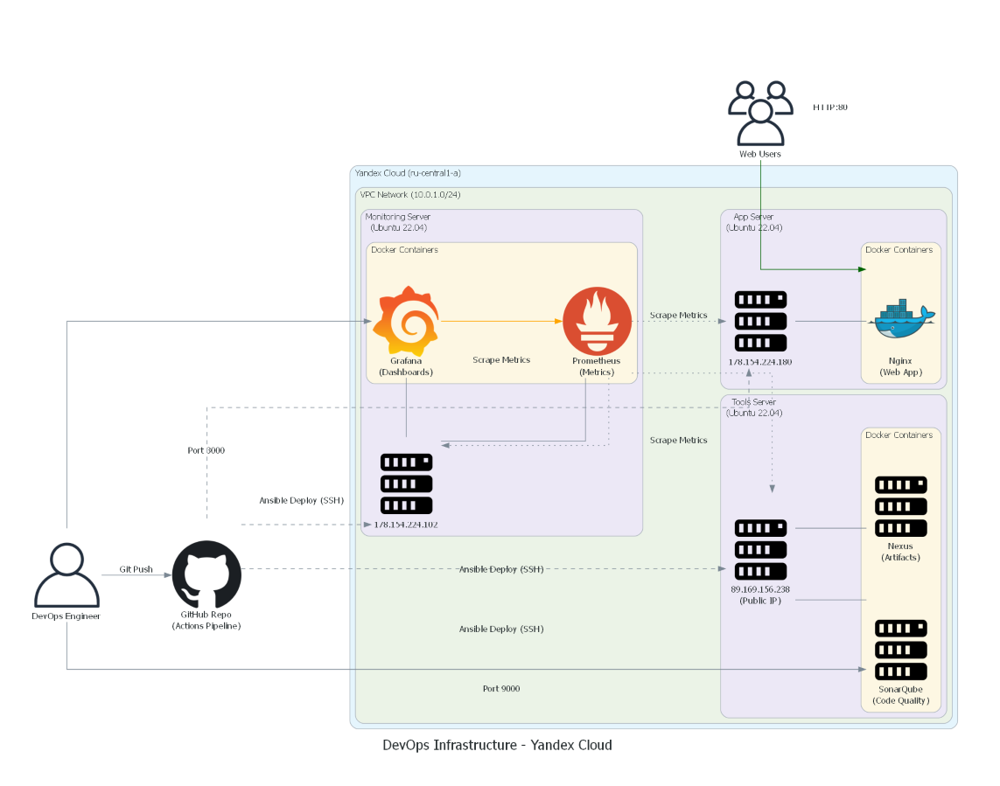

# DevOps Infrastructure Project on Yandex Cloud

Проект разворачивает отказоустойчивую инфраструктуру для веб-приложения с использованием IaC и CI/CD практик.

##  Технологический стек
*   **Cloud:** Yandex Cloud
*   **IaC:** Terraform
*   **Config Management:** Ansible
*   **Containerization:** Docker
*   **CI/CD:** GitHub Actions
*   **Monitoring:** Prometheus + Grafana
*   **Code Quality:** SonarQube

##  Структура проекта
*   `/terraform` - Описание инфраструктуры (VPC, VM, Compute).
*   `/ansible` - Плейбуки для настройки серверов.
*   `/src` - Исходный код веб-приложения.
*   `/docker` - Dockerfile для сборки.

##  Как запустить
1.  Установить Terraform и Ansible.
2.  В папке `terraform` выполнить `terraform apply`.
3.  Внести IP-адреса в `ansible/hosts.ini`.
4.  Запустить плейбуки: `ansible-playbook -i hosts.ini install_docker.yml`.

##  Доступы (Логины и Пароли в архиве)
*   **Веб-приложение (Nginx):** http://158.160.172.167
*   **Мониторинг (Grafana):** http://89.169.159.247:3000
*   **Сбор метрик (Prometheus):** http://89.169.159.247:9090
*   **Качество кода (SonarQube):** http://130.193.49.218:9000
*   **Хранилище артефактов (Nexus):** http://130.193.49.218:8081
